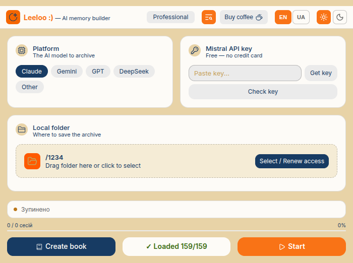

# Leeloo :) — AI Memory Builder

**Never lose a conversation with AI again.** Leeloo is a Chrome extension that automatically archives your Claude, Gemini, ChatGPT, and DeepSeek conversations — full transcripts, smart summaries, and searchable memory — straight to your own storage: Google Drive, Dropbox, OneDrive, or local disk.

No cloud lock-in, no Leeloo-run backend server. Note: to generate summaries, conversation text is sent to the AI provider you choose (Claude, Gemini, GPT, etc.) via their API — see [Privacy](#privacy) below.

## Why Leeloo

- 🗂️ **Multi-platform archiving** — Claude, Gemini, ChatGPT, DeepSeek (and more via "Other")
- ☁️ **Your storage, your rules** — Google Drive, OneDrive, Dropbox, or fully local
- 🧠 **Tagged summaries, not just backup** — auto-generates tagged summaries per session and a running `memory.txt` index of the whole archive
- 🤖 **Bring your own AI for summaries** — pick any model to generate the shorts, independent of which platform you're archiving: Claude, Gemini, GPT, DeepSeek, OpenRouter, Qwen, HuggingFace, Mistral, Groq (conversation text is sent to that provider's API for this purpose)
- 🗺️ **Self-updating archive map** — automatically inserts a map of your archive (path + folder structure + reading strategy) into the model's system prompt on every session, so the AI knows *where* its history with you lives. Note: this is a map, not the content itself — see [System prompt](#system-prompt) below for exactly what gets inserted
- ⚡ **Lite mode** — single-screen, minimal setup, local-only, for when you just want it to work
- 🇺🇦 🇬🇧 Full UA/EN localization, dark theme

## Privacy

- Leeloo has **no backend server of its own** — there is no Leeloo-operated infrastructure that your data passes through.
- Full transcripts and summaries are written directly to **the storage you choose**: your own Google Drive, Dropbox, OneDrive, or local disk.
- To **generate summaries**, the conversation text is sent to the AI provider you select (Claude, Gemini, GPT, DeepSeek, etc.) via that provider's official API, using your own API key. That provider's own privacy policy applies to this data.
- API keys and cloud access tokens are currently stored in the browser's local storage. This is acceptable for personal/MVP use, but not yet hardened for wide public release — treat your keys accordingly (don't share your browser profile, revoke keys you're not using).
- The system prompt inserted into the model is an **archive map** (path + structure), not archive content — see [System prompt](#system-prompt) and [Making memory actually work today](#making-memory-actually-work-today) for exactly what's sent, and what each platform can (and can't) do with it.

## Demo

📺 [Watch the demo video](https://youtu.be/BnSpNMiTV-M)



## Installation

### Chrome / Edge / Brave

1. Download or clone this repository
2. Open `chrome://extensions/`
3. Enable **Developer mode** (top right)
4. Click **Load unpacked**
5. Select the `leeloo/` folder

---

## What it does

1. Numbers all conversation sessions
2. Stores full transcripts in `full/`
3. Automatically generates short, tagged summaries in `short/`
4. Maintains `memory.txt` — a concise overview of the entire archive
5. Logs internal service sessions to `_system/` (kept separate from the archive)
6. Automatically inserts an archive map (path, folder structure, reading strategy) into the model's system prompt on every launch — see [System prompt](#system-prompt)

---

## Setup

### Google Drive
- Create a root folder for the archive
- Copy the folder ID from the URL: `drive.google.com/drive/folders/**THIS_IS_THE_ID**`
- Paste the ID into the "Google Drive — root folder ID" field

### API keys (for generating summaries)
| Platform | Where to get it |
|-----------|-------------|
| Claude | console.anthropic.com → API Keys |
| Gemini | aistudio.google.com → Get API key |
| GPT | platform.openai.com → API keys |
| DeepSeek | platform.deepseek.com → API keys |
| OpenRouter | openrouter.ai → Keys |
| Qwen | dashscope.console.aliyun.com → API keys |
| HuggingFace | huggingface.co → Settings → Access Tokens |
| Mistral | console.mistral.ai → API keys |
| Groq | console.groq.com → API keys |

---

## Archive structure

```
[Root folder]/
  claude/
    full/
      full_001-099.txt    ← full transcripts, sessions 1-99
      full_100-201.txt    ← sessions 100-201
    short/
      short_001-099.txt   ← tagged short summaries
    _system/
      sys_001_processing_1.txt  ← internal service sessions (not for reading)
    memory.txt            ← summary of the entire archive
```

---

## Processing modes

| Mode | Description |
|-------|------|
| **New sessions** | Adds sessions after the last one saved. For regular use. |
| **Automatic** | Fills gaps in the archive. For recovery after failures. |
| **All** | Rebuilds the archive from scratch. |
| **Select** | Manually pick specific sessions. |

---

## Limits

**Archive:** once a set size is reached (2 MB by default), a new file is created with a marked session range.

**Model:** once the API limit is reached, progress is saved automatically. "Resume now" or "Stop and save" buttons are available.

---

## System prompt

After processing finishes, the extension automatically inserts an **archive map** into the model's system prompt — the path, folder structure, and a suggested reading strategy:

```
<memory_archive>
This is your archive of all conversations with the user.
Path: [Drive: ...]/claude/
Total sessions: ...

FILE STRUCTURE:
memory.txt      — short summary of all sessions, start here
tags.txt        — weighted topic tags
full/full_NNN.txt   — full text of session NNN
short/short_NNN.txt — short overview of session NNN
...

READING STRATEGY:
Overall picture      → memory.txt
Search by topic       → tags.txt → find sessions → short_NNN.txt
...
</memory_archive>
```

**Important:** this is a map of the archive, not its contents. The extension does not read `memory.txt` or any summaries and paste their text into the prompt — it only tells the model *where things are*. Whether the model can act on that map depends entirely on the platform and its own connectors (see [Making memory actually work today](#making-memory-actually-work-today) below) — Leeloo itself does not give the model a way to read files.

If you want the model to see archive content today without relying on a platform's own connector, use the **book** export feature (`Books` in the popup) to compile `memory.txt` / tags / summaries / full transcripts into a single file, and paste or attach that manually.

The archive-map prompt above is (re-)inserted into the active model tab on every new session/launch.

---

## Making memory actually work today

The archive-map prompt tells the model *where* its history lives, but only some platforms can act on that on their own — and even then, not automatically. Here's the honest state of each, as of mid-2026:

| Platform | Native file access? | What that means in practice |
|---|---|---|
| **Claude (claude.ai)** | Yes — official Google Drive connector | Real tool use: once connected, Claude can decide on its own to look something up in Drive, but each lookup needs your one-click approval. It won't reliably start doing this just because the archive-map prompt is sitting there — you'll often need to nudge it ("check the archive for session 42"). |
| **Gemini (gemini.google.com)** | Yes — Drive & Gmail extensions | Same idea, less reliable in practice: it will sometimes say "I don't see anything" even when the extension is on. If that happens, try pointing it at Gmail instead of Drive (or vice versa) rather than repeating the same request. |
| **ChatGPT (chatgpt.com)** | Yes — Google Drive connector (paid tiers) | You pick files manually per conversation; it does keyword matching, not semantic search, and won't browse your whole archive on its own. |
| **DeepSeek (chat.deepseek.com)** | No native connector | No in-chat way to reach Drive at all. Manual export (see below) is the only option. |

**Known extra gotcha (Gemini/Gmail-based memory in general):** if you keep your archive content in an email rather than a Drive file, the content needs to be **in the body of the email itself** — attachments are not read even when the model technically has mail access.

**Practical workflow that actually works today, on any platform:**
1. Rely on the archive-map prompt only as an index — don't expect the model to "just know" things from it.
2. When you need the model to actually know a specific session, ask it directly to look it up via its own connector (if the platform has one) — be specific about the file name/session number.
3. If the connector doesn't work, or the platform has none (DeepSeek), use the **Books** export feature to compile the relevant `short_*`/`full_*`/`memory.txt` content into one file, then paste it into the chat yourself.
4. This is manual and a bit clunky by design, for now — real automatic retrieval (the model finding and pulling in the right session content on its own, without your help) is on the roadmap, not yet implemented.

---

## Permissions

| Permission | Why |
|--------|--------|
| `storage` | Save extension settings |
| `scripting` | Insert the system prompt |
| `tabs` | Find the open model tab |
| `alarms` | Auto-resume after hitting a limit |
| `identity` | OAuth for cloud storage |

---

## Supported platforms

- **Browsers:** Chrome, Edge, Brave (Manifest V3)
- **Models:** Claude (claude.ai), Gemini (gemini.google.com), ChatGPT (chatgpt.com), DeepSeek (chat.deepseek.com)
- **Storage:** Google Drive, OneDrive, Dropbox, local
